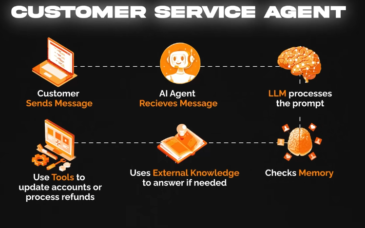

### Agent components

1. LLM 
2. Prompting
3. Memory
4. External knowledge
5. Tools

#### Types of Agent

1. Conversational Agent
2. Automated Agent

#### Design patterns

1. ReAct

Most popular agent pattern.

Re : Reasoning
Act : Acting

Instead of generating answewr in one go, model thinks step by step, deciding what it needs to do next and optionally calling tools to help it.

+----------------------------------------+
EXAMPLE

User : What is the population of capital of France?

Agent

Thought : I need to find the capital of France
Action : search_tool
Action_input : "Capital of franch"
Observation : Paris
Thought : Now I need populaton of Paris
Action : search_tool
Action_input : "Population of Paris"
Observation : 2.1 million
Final_answer : Paris is the capital of France. Population of Paris is 2.1 million

Loop of **Thought -> Action -> Observe** breaks

#### agent and agent executer for React

Agent executer orchestrates entire loop

1. Sends input and previous messages to the agent
2. Gets the next action from agent
3. Executes the tool with inputs provided
4. Adds tool's observation back into history
5. Loops again with updated history until agent says Final_answer.

Notice, there is thought trace

#### Other Design Patterns

1. Router Pattern
Agent decides which tool/model/path to use.
Example: Send coding questions to a coding agent and HR questions to an HR agent.

2. Chain Pattern
Output of one step becomes input to the next.
Example: Retrieve → Summarize → Generate Answer.

3. Planner-Executor Pattern
One agent creates a plan.
Another agent executes it.
Very common in autonomous agents.

4. Reflection Pattern
Agent reviews and improves its own output.
"Critique and revise."

5. Multi-Agent Pattern
Multiple specialized agents collaborate.
Example: Researcher, Coder, Reviewer.

6. Supervisor Pattern
A central agent coordinates other agents.
Like a manager overseeing workers.

7. Hierarchical Pattern
Manager agents delegate tasks to sub-agents.

8. Human-in-the-Loop Pattern
Agent pauses for human approval at critical steps.

9. Retrieval-Augmented Pattern (RAG)
Agent retrieves information from a knowledge base before answering.
RAG is better viewed as a retrieval architecture/pattern that agents can use. AG is primarily an LLM application pattern (knowledge retrieval pattern)